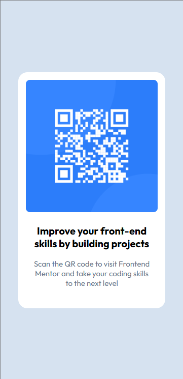

# Frontend Mentor - QR code component

Esta é uma solução para o [desafio de  QR code component coding challenge](https://www.frontendmentor.io/challenges/qr-code-component-iux_sIO_H). Os desafios do Frontend Mentor ajudam você a melhorar suas habilidades de codificação construindo projetos realistas. 

## Índice

- [Visão geral](#visão-geral)
- [O desafio](#o-desafio)
- [Captura-de-tela](#captura-de-tela)

## Visão geral

### O desafio

Os usuários devem ser capazes de:

- Visualizar o layout ideal dependendo do tamanho da tela do dispositivo
- Ver estados de foco para elementos interativos

### Captura de tela

### Desktop

### Mobile

